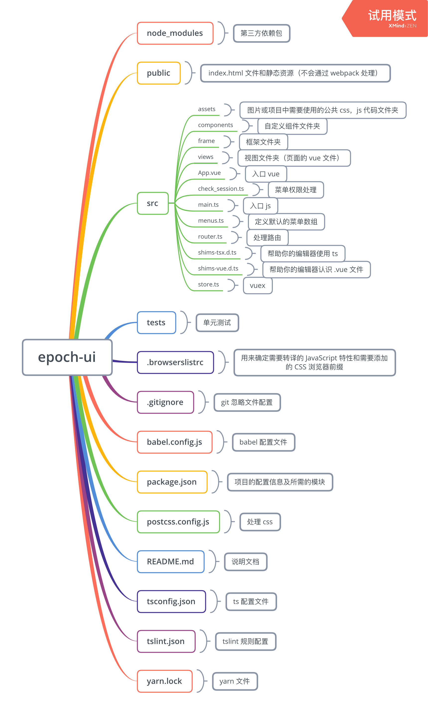

# epoch-ui

## 目录结构


## 菜单说明
如果是页面中的按钮进入的下一级页面，需要在 menus.ts 定义的时候加入一个字段 sub:true。如果没有这个字段，则说明是菜单上面的页面。

## apiConfig.ts
后端请求接口 ip 配置文件

## axios_config.ts
axios 配置文件，使用的时候按以下情况调用
- get 请求
    ```javascript
    this.$axios.axiosGet(url, data).then(res=>{})
    ```
- post 请求
    ```javascript
    // 第三个参数为请求的参数是否为 json 格式，如为表单格式，可不传，默认 false，下同。
    this.$axios.axiosPost(url, data, true).then(res=>{})
    ```
- put 请求
    ```javascript
    this.$axios.axiosPut(url, data, true).then(res=>{})
    ```
- delete 请求
    ```javascript
    this.$axios.axiosDelete(url, data, true).then(res=>{})
    ```

## 字体文件压缩：font-spider
1. 全局安装：
    ```
    npm install font-spider -g
    ```
2. 安装之后执行以下命令
    ```
    // 在打包完成之后，进入 dist 文件夹执行
    // --debug 打印报错信息，可不写
    font-spider --debug index.html
    ```

3. 该项目已将上述命令写入 build 命令，只需执行第一步即可

## 工程依赖安装
```
yarn install
```

## 启动服务
```
yarn run serve
```

## 打包工程
```
yarn run build
```

## Run your tests
```
yarn run test
```

## Lints and fixes files
```
yarn run lint
```

## Run your unit tests
```
yarn run test:unit
```

## Customize configuration
See [Configuration Reference](https://cli.vuejs.org/config/).
